<p align="center">
  
</p>

<h1 align="center">AInime</h1>

<p align="center">
  <strong>AI-Powered Anime Discovery Platform</strong>
</p>

<p align="center">
  <a href="#overview">Overview</a> &bull;
  <a href="#screenshots">Screenshots</a> &bull;
  <a href="#features">Features</a> &bull;
  <a href="#tech-stack">Tech Stack</a> &bull;
  <a href="#architecture">Architecture</a> &bull;
  <a href="#getting-started">Getting Started</a> &bull;
  <a href="#api-endpoints">API</a> &bull;
  <a href="#security">Security</a> &bull;
  <a href="#deployment">Deployment</a>
</p>

<p align="center">
  
  
  
  
  
  
</p>

---

## Overview

**AInime** is a full-stack anime discovery platform that combines AI-powered natural language search with comprehensive anime tracking tools. Instead of clicking through endless genre filters, users can describe what they want in plain language (including Indonesian) and get intelligent results powered by Google's Gemini 2.5 Flash Lite model -- with the API key kept entirely server-side.

The platform brings together anime discovery (trending, popular, seasonal data from Jikan API with AniList GraphQL fallback), personal watchlists with episode progress tracking, a drag-and-drop tier list creator with community sharing, and a seasonal broadcast calendar grouped by airing day. All backed by Firebase Authentication and an Express.js backend with PostgreSQL via Prisma ORM.

> **Note:** By default, the app runs with `VITE_USE_LOCAL_ONLY=true`, which stores anime list and tier list data in localStorage. The PostgreSQL backend is fully implemented and ready, but requires database setup to activate.

---

## Screenshots

### Home -- Anime Discovery
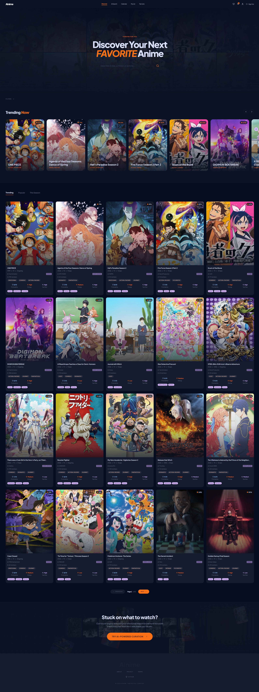
*Browse trending, popular, and seasonal anime with genre filters, format/status/year selectors, and a horizontal trending carousel.*

### AI Search
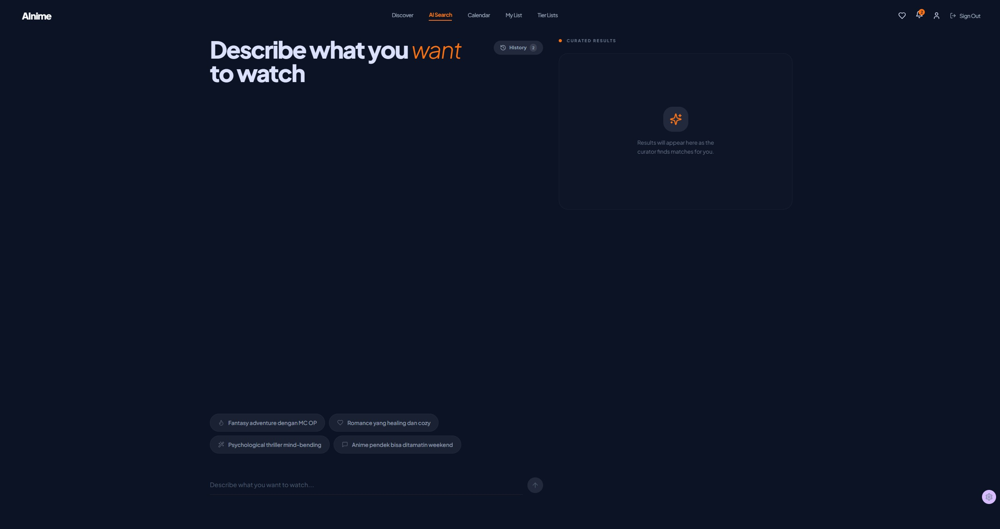
*Natural language search with multi-turn conversation, quick prompt suggestions, and curated results panel.*

### Anime Detail
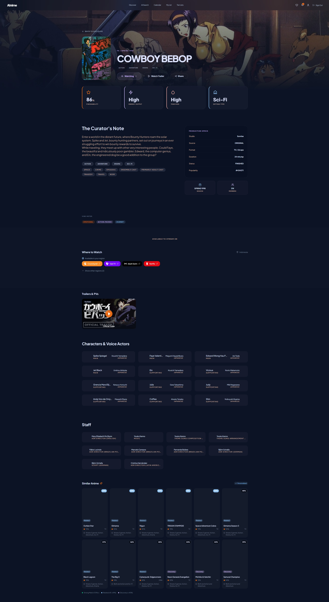
*Comprehensive anime page with score cards, synopsis, production info, streaming links, trailers, characters and voice actors, staff credits, and AI-enhanced similar anime recommendations.*

### Seasonal Calendar
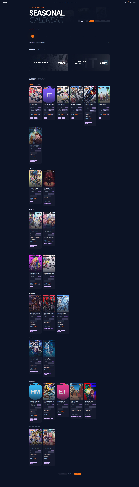
*Track airing anime organized by broadcast day (Sunday through Saturday), with season/year selectors and day filters.*

### My List
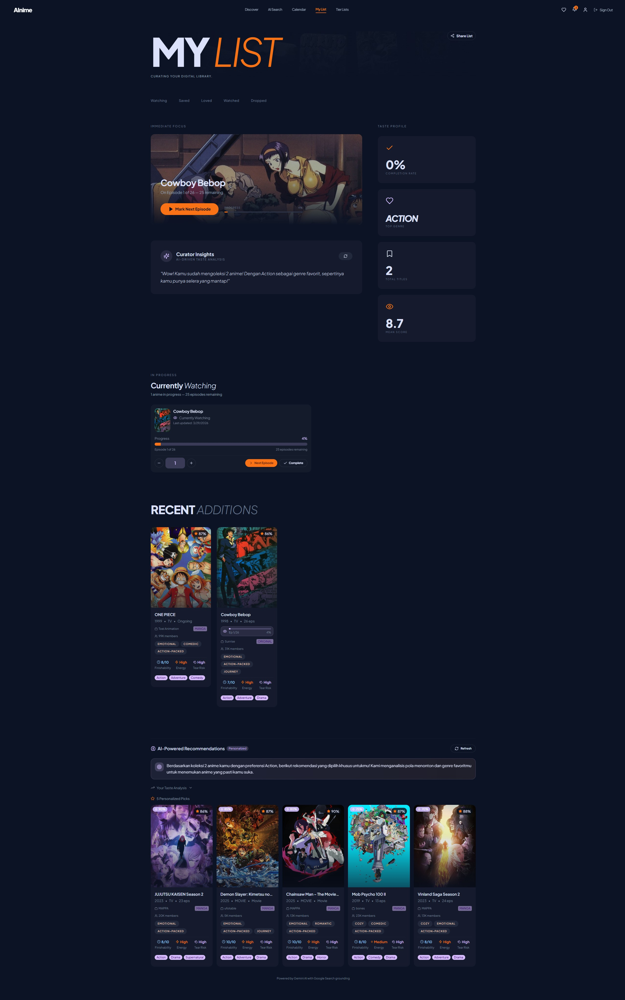
*Manage your anime collection with status categories, episode progress tracking, AI curator insights, taste profile stats, and Gemini-powered personalized recommendations.*

### Tier Lists
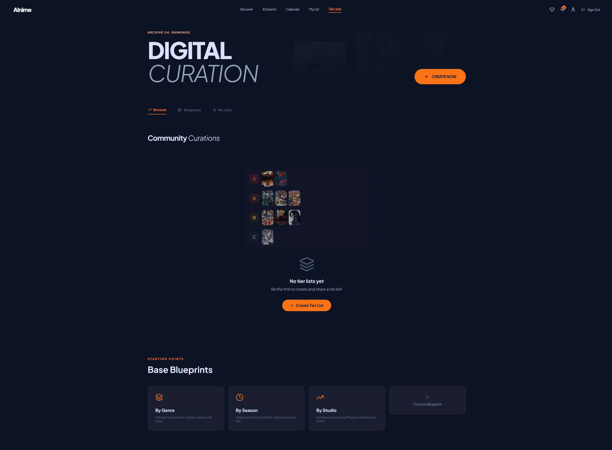
*Drag-and-drop tier list creator with S through F tiers, community browsing, and starter templates (by genre, season, studio).*

### Authentication
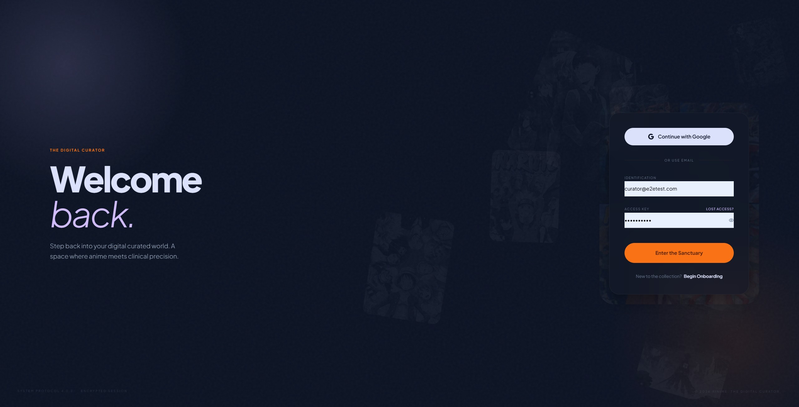
*Sign in with Google OAuth or email/password. The Digital Curator themed login with anime backdrop.*

### About
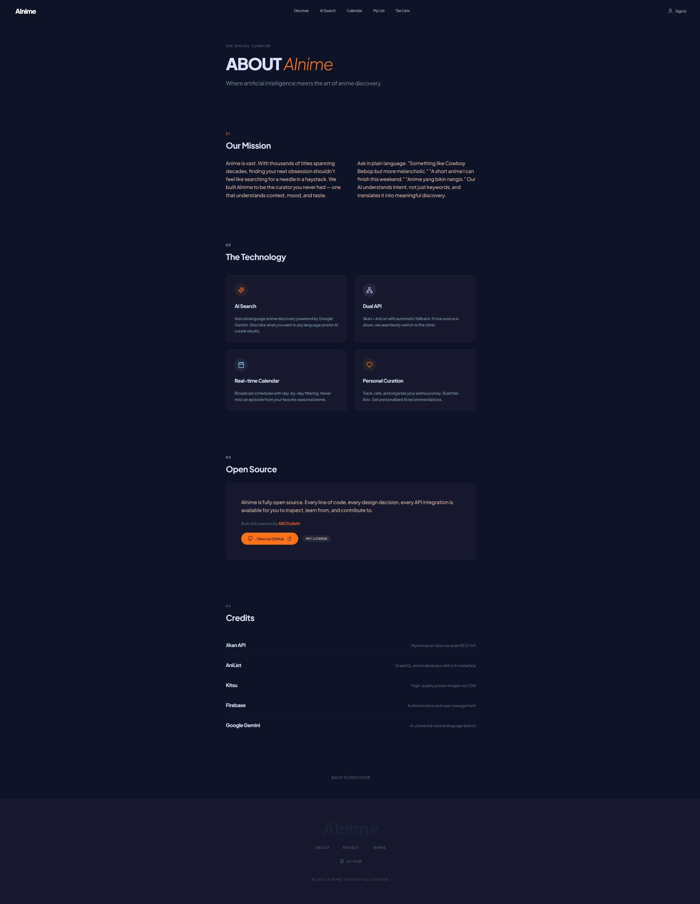
*Project mission, technology overview, open source info, and credits.*

---

## Features

- **AI-Powered Search** -- Conversational anime search using Gemini 2.5 Flash Lite via a server-side Express proxy. The API key never reaches the browser. Supports multi-turn conversations, Indonesian language queries, and context-aware refinement chips ("make it shorter", "more comedy-focused").

- **Anime Discovery** -- Browse trending, popular, and seasonal anime. Data sourced from Jikan/MAL REST API as primary, with AniList GraphQL as automatic fallback. Genre, format, status, season, year, and score filters.

- **Seasonal Calendar** -- View currently airing anime organized by broadcast day (Sunday through Saturday). Filter by specific days, select any season/year combination, and track your weekly schedule.

- **Personal Anime List** -- Organize anime into SAVED, LOVED, WATCHING, WATCHED, and DROPPED categories. Track episode progress per series with an inline progress tracker. Ratings from 1-10. AI-powered curator insights and taste analysis.

- **Tier List Creator** -- Drag-and-drop interface to rank anime across S, A, B, C, D, and F tiers. Save with public, friends-only, or private visibility. Community browsing, like system, and starter templates (by genre, season, studio).

- **Firebase Authentication** -- Sign in with Google OAuth or Email/Password. JWT token verification on the backend with automatic user upsert in PostgreSQL.

- **Profile and Privacy** -- Watch statistics (completion rate, top genre, mean score, total titles), search history, and granular privacy controls (profile, list, activity visibility as public/friends-only/private).

- **PWA Support** -- Installable as a standalone app. Offline fallback page, Workbox service worker with runtime caching for Jikan API (24h), AniList API (1h), and image CDNs (7 days).

- **The Digital Curator Dark Theme** -- Custom dark color scheme (#1a1f2e base) with coral, violet, teal, and gold accent colors. DM Sans font family. Consistent editorial aesthetic across all pages.

- **Kitsu CDN Image Proxy** -- For environments where MAL/AniList image CDNs are blocked (e.g., corporate firewalls), the app automatically maps MAL IDs to Kitsu poster URLs with localStorage caching (7-day TTL). Initials avatar fallback on image load failure.

---

## Tech Stack

| Category | Technology |
|----------|------------|
| **Frontend** | React 18, TypeScript 5.8, Vite 5, Tailwind CSS 3.4, shadcn/ui, React Router v6, TanStack Query v5 |
| **Backend** | Express.js 4, Prisma ORM 6.5, PostgreSQL, Firebase Admin SDK 13 |
| **Authentication** | Firebase Auth (Google OAuth, Email/Password) |
| **AI** | Gemini 2.5 Flash Lite API (server-side only via Express proxy) |
| **APIs** | Jikan/MAL REST API (primary), AniList GraphQL (fallback), Kitsu API (image proxy) |
| **Validation** | Zod (server-side input validation on all routes) |
| **Security** | Helmet.js, CORS origin whitelist, express-rate-limit |
| **State Management** | React Query (server state), Context API (auth, data source), localStorage (privacy, Kitsu cache) |
| **Forms** | React Hook Form, Zod validation |
| **Charts** | Recharts |
| **PWA** | vite-plugin-pwa, Workbox |

---

## Architecture

### System Architecture

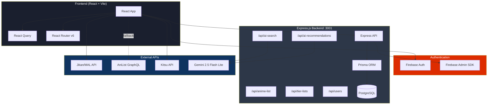

### AI Search Flow

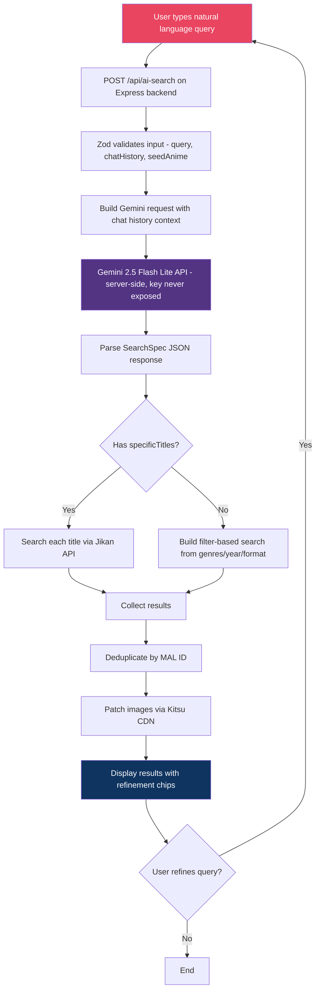

### Auth Flow

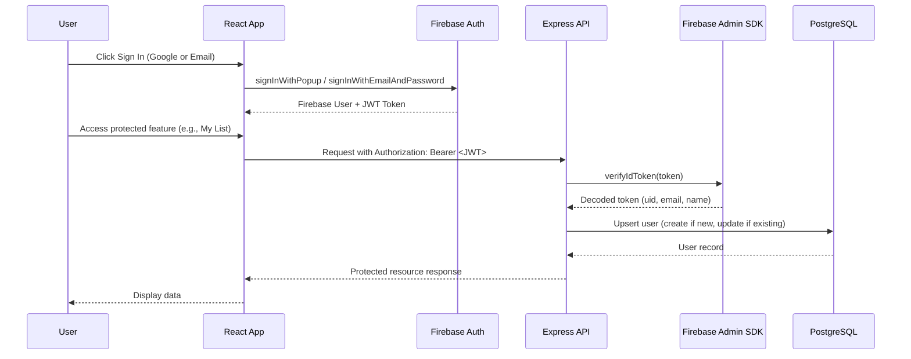

### Data Flow

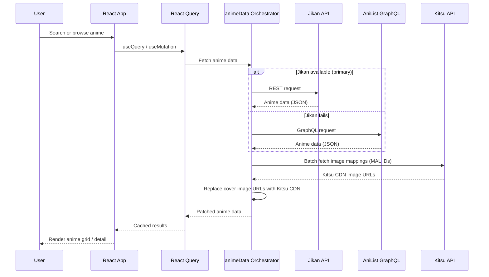

### Image Proxy Flow

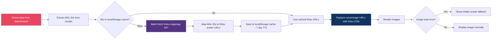

---

## Getting Started

### Prerequisites

- **Node.js** 18+
- **npm** or **pnpm**
- **PostgreSQL** database (optional -- app works with localStorage by default)
- **Firebase** project (for authentication)
- **Gemini API key** (optional, for AI search -- [get one free](https://aistudio.google.com/apikey))

### Installation

```bash
# Clone the repository
git clone https://github.com/ABCDullahh/ainime.git
cd ainime

# Install frontend dependencies
npm install

# Install backend dependencies
cd server
npm install

# Generate Prisma client
npx prisma generate

# Return to root
cd ..
```

### Environment Variables

Create a `.env` file in the project root:

#### Frontend + Backend (`/.env`)

| Variable | Description | Required |
|----------|-------------|----------|
| `VITE_API_URL` | Backend API base URL (defaults to `/api`) | No |
| `VITE_USE_LOCAL_ONLY` | Use localStorage instead of PostgreSQL (defaults to `true`) | No |
| `GEMINI_API_KEY` | Google Gemini API key for AI search -- **server-side only, never prefixed with VITE_** | Optional |

#### Backend (`/server/.env`)

| Variable | Description | Required |
|----------|-------------|----------|
| `DATABASE_URL` | PostgreSQL connection string | Yes (if using DB) |
| `FIREBASE_SERVICE_ACCOUNT` | Path to Firebase service account JSON file | Yes* |
| `FIREBASE_PROJECT_ID` | Firebase project ID (alternative to service account file) | Yes* |
| `FIREBASE_CLIENT_EMAIL` | Firebase service account email | Yes* |
| `FIREBASE_PRIVATE_KEY` | Firebase service account private key | Yes* |
| `GEMINI_API_KEY` | Google Gemini API key for AI recommendations | Optional |
| `CORS_ORIGIN` | Comma-separated allowed origins (defaults to `http://localhost:3232`) | No |
| `PORT` | Server port (defaults to `3001`) | No |

> \* Provide either `FIREBASE_SERVICE_ACCOUNT` file path OR the individual `FIREBASE_PROJECT_ID`, `FIREBASE_CLIENT_EMAIL`, and `FIREBASE_PRIVATE_KEY` variables.

### Development

```bash
# Start frontend dev server (port 3232)
npm run dev

# In a separate terminal, start backend server (port 3001)
cd server
npm run dev
```

The frontend dev server runs at **http://localhost:3232** with Vite's proxy forwarding `/api` requests to the backend at port 3001.

### Database Setup (Optional)

If you want to use PostgreSQL instead of localStorage:

```bash
cd server

# Push schema to database
npx prisma db push

# Open visual database browser (optional)
npx prisma studio
```

Set `VITE_USE_LOCAL_ONLY=false` in your `.env` to switch to the database backend.

---

## API Endpoints

All endpoints are prefixed with `/api`. Protected routes require a Firebase JWT token in the `Authorization: Bearer <token>` header.

### Health Check

| Method | Endpoint | Auth | Description |
|--------|----------|------|-------------|
| `GET` | `/api/health` | No | Server health check |

### AI Search

| Method | Endpoint | Auth | Description |
|--------|----------|------|-------------|
| `POST` | `/api/ai-search` | No | AI-powered anime search via Gemini (server-side proxy, rate limited to 10 req/min) |

**Request body:**
```json
{
  "query": "anime yang bikin nangis",
  "chatHistory": [{ "role": "user", "content": "..." }],
  "seedAnime": { "title": "Cowboy Bebop", "genres": ["Action"] }
}
```

### Anime List

| Method | Endpoint | Auth | Description |
|--------|----------|------|-------------|
| `GET` | `/api/anime-list` | Yes | Get authenticated user's anime list |
| `PUT` | `/api/anime-list` | Yes | Upsert an anime entry (animeId, status, rating, notes) |
| `PATCH` | `/api/anime-list/:animeId/progress` | Yes | Update episode progress (lastEpisodeWatched) |
| `DELETE` | `/api/anime-list/:animeId` | Yes | Remove anime from user's list |

### Tier Lists

| Method | Endpoint | Auth | Description |
|--------|----------|------|-------------|
| `GET` | `/api/tier-lists` | Optional | List public tier lists (shows like status if authenticated) |
| `GET` | `/api/tier-lists/mine` | Yes | Get authenticated user's tier lists |
| `GET` | `/api/tier-lists/:id` | Optional | Get single tier list with items (respects visibility settings) |
| `POST` | `/api/tier-lists` | Yes | Create new tier list with items |
| `PUT` | `/api/tier-lists/:id` | Yes | Update tier list (owner only) |
| `DELETE` | `/api/tier-lists/:id` | Yes | Delete tier list (owner only) |
| `POST` | `/api/tier-lists/:id/like` | Yes | Toggle like on a tier list |

### Users

| Method | Endpoint | Auth | Description |
|--------|----------|------|-------------|
| `PATCH` | `/api/users/me` | Yes | Update profile and privacy settings |
| `GET` | `/api/users/:id/privacy` | No | Get a user's public privacy settings |

### AI Recommendations

| Method | Endpoint | Auth | Description |
|--------|----------|------|-------------|
| `POST` | `/api/ai-recommendations` | Yes | Generate AI-powered recommendations from user's watch list |

---

## Security

- **Server-side API keys** -- The Gemini API key is only used on the Express backend (`process.env.GEMINI_API_KEY`). It is never exposed to the browser via `VITE_` prefixed variables.
- **Rate limiting** -- Global limit of 100 requests/minute per IP on all `/api` routes. AI endpoints (`/api/ai-search`, `/api/ai-recommendations`) have a stricter limit of 10 requests/minute.
- **Helmet.js** -- Security headers (X-Content-Type-Options, X-Frame-Options, etc.) applied to all Express responses.
- **CORS** -- Restricted to explicit allowed origins via `CORS_ORIGIN` environment variable. Defaults to `http://localhost:3232`.
- **Zod validation** -- All Express route inputs are validated with Zod schemas before processing (query length limits, array size caps, type enforcement).
- **Firebase JWT verification** -- Protected routes verify Firebase ID tokens via Firebase Admin SDK before granting access.
- **No secrets in client code** -- The `src/` directory contains zero references to `VITE_GEMINI` or Supabase credentials. The Firebase config in `src/lib/firebase.ts` contains only public client-side identifiers (API key, project ID), which is standard for Firebase web apps.

---

## Deployment

### Frontend

```bash
# Build production bundle
npm run build

# Output in /dist - serve as static files
npm run preview   # Preview locally
```

The `dist/` directory contains the compiled static files ready for deployment to any static hosting provider.

### Backend

```bash
cd server

# Build TypeScript
npm run build

# Run migrations
npx prisma migrate deploy

# Run production server
npm start
```

### Infrastructure

| Component | Recommendation |
|-----------|---------------|
| **Frontend** | Vite build output (`dist/`) deployed to any static host (Nginx, Vercel, Netlify) |
| **Backend** | Express.js on a VPS or container (Docker, Railway, Render) |
| **Database** | PostgreSQL (Railway, Neon, or self-hosted) |
| **Auth** | Firebase -- add your deployment domain to Firebase Console > Authentication > Settings > Authorized domains |

### Nginx Reverse Proxy (Example)

```nginx
server {
    listen 80;
    server_name yourdomain.com;

    # Frontend static files
    location / {
        root /var/www/ainime/dist;
        try_files $uri $uri/ /index.html;
    }

    # Backend API proxy
    location /api/ {
        proxy_pass http://localhost:3001;
        proxy_http_version 1.1;
        proxy_set_header Upgrade $http_upgrade;
        proxy_set_header Connection 'upgrade';
        proxy_set_header Host $host;
        proxy_cache_bypass $http_upgrade;
    }
}
```

---

## License

This project is licensed under the MIT License. See the [LICENSE](LICENSE) file for details.

Copyright (c) 2026 ABCDullahh

---

## Acknowledgments

- [Jikan](https://jikan.moe) -- MAL API wrapper for anime data
- [AniList](https://anilist.co) -- GraphQL anime database API
- [Kitsu](https://kitsu.app) -- Anime image CDN and ID mappings
- [Google Gemini](https://ai.google.dev) -- AI model for search and recommendations
- [shadcn/ui](https://ui.shadcn.com) -- UI component library
- [Firebase](https://firebase.google.com) -- Authentication infrastructure

---

<p align="center">
  <sub>Built for anime fans, by anime fans.</sub>
</p>

<p align="center">
  <a href="#ainime">Back to top</a>
</p>
